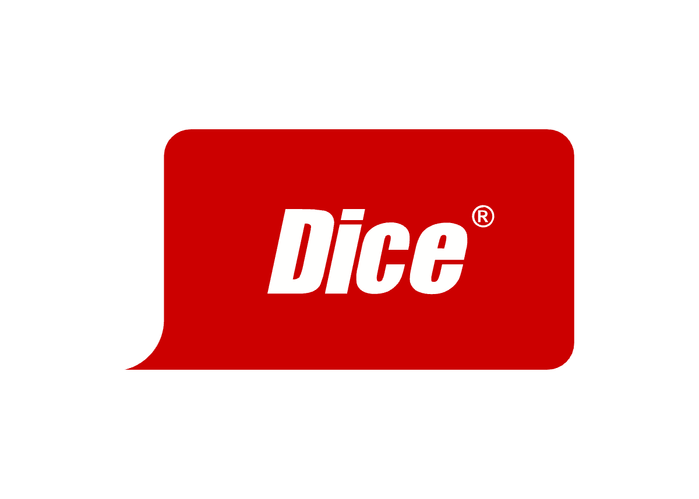

<a name="top"></a>
<div align="center">


# Dice Job Application Automation for Third Party Jobs🚀

[](https://www.python.org/)
[](https://www.selenium.dev/)
[](./MIT%20License)
[](https://github.com/Deeraj7/dice-job-automation)

**Automate your job application process on Dice.com using Selenium WebDriver. Simplify and streamline your job search with one-click applications, intelligent filtering, and smart handling of applied jobs.**

</div>

---

## Table of Contents

1. [Introduction](#introduction)
2. [Features](#features)
3. [Installation](#installation)
4. [Configuration](#configuration)
5. [Usage](#usage)
6. [Troubleshooting](#troubleshooting)
7. [Contributors](#contributors)
8. [License](#license)
9. [Disclaimer](#disclaimer)

---

## Introduction

The **Dice Job Application Automation** tool is designed to make the job application process on Dice.com more efficient and less time-consuming. By automating repetitive tasks, it allows job seekers to focus on interview preparation and skill-building rather than filling out forms repeatedly. Built with Python and Selenium, this tool includes features such as automatic job searching, one-click application, and shadow DOM handling.

## ✨ Features

- ✅ **Automated Login to Dice.com**
- 🔍 **Customizable Job Search**: Allows searching with specific keywords and filters
- 🎯 **Intelligent Filtering**: Only applies to relevant jobs (e.g., today's job postings, non-third-party listings)
- ⚡ **"Easy Apply" Automation**: One-click application submission for jobs with Easy Apply
- 🔄 **Smart Handling of Previously Applied Jobs**: Skips jobs that you've already applied to
- 💡 **Shadow DOM Interaction**: Interacts with modern web elements, including those hidden in Shadow DOM
- 📊 **Detailed Logging**: Keeps a log of the application process for easy tracking

---

## 📂 Project Structure

```
dice-job-automation/
├── README.md
├── requirements.txt
├── config.py
├── main.py
└── src/
    ├── __init__.py
    ├── automation.py
    ├── handlers/
    │   ├── __init__.py
    │   ├── job_handler.py
    │   ├── shadow_dom_handler.py
    │   └── search_filter_handler.py
    └── utils/
        ├── __init__.py
        └── webdriver_setup.py
```

---

## 📋 Requirements

- **Python 3.x**
- **Chrome Browser**
- **ChromeDriver** matching your Chrome version
- Required Python packages listed in `requirements.txt`

---

## ⚙️ Installation

1. **Clone the Repository**
   ```bash
   git clone https://github.com/Deeraj7/dice-job-automation.git
   cd dice-job-automation
   ```

2. **Install Required Packages**
   ```bash
   pip install -r requirements.txt
   ```

3. **Configure Credentials**
   Create a `config.py` file with your Dice.com credentials, search settings, and resume path:
   ```python
   CREDENTIALS = {
       "username": "your_email@example.com",
       "password": "your_password"
   }

   SEARCH_SETTINGS = {
       "keyword": "Data Engineer",
       "max_applications": 10
   }

   RESUME_SETTINGS = {
       "path": "/path/to/your/resume.pdf"  # Full path to your resume file
   }
   ```

---

## 🚀 Usage

1. Update `config.py` with your Dice.com credentials and search preferences.
2. Run the script:
   ```bash
   python main.py
   ```

---

## 🔧 Configuration Options

In `config.py`, you can customize:
- **Login Credentials**: Username and password for Dice.com.
- **Search Keywords**: The keyword(s) to search for relevant job postings.
- **Max Applications**: Maximum number of applications per run.
- **Resume Path**: Specify the path to your resume file, which will be used in applications.
- **Other Search Filters**: You can add filters based on other criteria to further refine job search.

---

## 🛠️ Troubleshooting

1. **Login Issues**
   - Double-check your credentials in `config.py`.
   - Ensure your ChromeDriver version matches your installed Chrome browser version.

2. **Application Process Stalls**
   - If the bot fails to click "Easy Apply," ensure that the jobs being targeted have the Easy Apply option.

3. **Shadow DOM Errors**
   - Ensure the `shadow_dom_handler.py` script is functioning correctly. Some web elements on Dice might require specific handling.

4. **Rate Limiting on Dice**
   - Dice.com might limit requests if too many actions are performed quickly. The script includes delays to mimic human behavior, but further customization may be needed.

---

## 👥 Contributors

[](https://github.com/Deeraj7/dice-job-automation)

<div align="left">
  <a href="https://github.com/Deeraj7">
    
  </a>
  <a href="https://github.com/hbuddana">
    
  </a>
</div>


---

## 📄 License

This project is licensed under the MIT License - see the [MIT License](./MIT%20License) file for details.

---

## ⚠️ Disclaimer

This tool is for educational purposes only. Use responsibly and in accordance with Dice.com's terms of service.

---

[Back to top 🚀](#top)
